# 📊 Sales Data Analysis & Business Insights

An interactive **Sales Data Analysis and Business Intelligence Dashboard** built using Python, Pandas, Plotly, and Streamlit to analyze sales performance, customer behavior, product performance, and regional business trends.

The project combines **Exploratory Data Analysis (EDA)** with an interactive dashboard to transform raw sales data into meaningful and actionable business insights.

---

## 🚀 Live Demo

🔗 **Streamlit Dashboard:**  
Coming Soon

---

## 📌 Project Overview

This project performs comprehensive analysis on a sales dataset to identify important business patterns and trends.

The analysis focuses on:

- Sales performance
- Customer behavior
- Product category performance
- Regional sales trends
- Customer segmentation
- Order patterns
- Gender-wise purchasing behavior
- Age-group purchasing behavior
- Occupation-wise sales
- Business performance indicators

An interactive Streamlit dashboard allows users to explore these insights dynamically using multiple filters and visualizations.

---

## 🎯 Project Objectives

The main objectives of this project are:

- Analyze overall sales performance
- Identify high-performing customer segments
- Determine the best-performing product categories
- Analyze sales across different states
- Understand customer purchasing patterns
- Compare sales performance across gender and age groups
- Identify top customers and products
- Generate automated business insights
- Build an interactive Business Intelligence dashboard

---

## 🛠️ Technologies Used

| Technology | Purpose |
|---|---|
| Python | Data analysis and application development |
| Pandas | Data cleaning and manipulation |
| NumPy | Numerical operations |
| Plotly | Interactive data visualization |
| Matplotlib | Statistical visualization |
| Seaborn | Exploratory data visualization |
| Streamlit | Interactive dashboard |
| Git & GitHub | Version control and project hosting |

---

## 📂 Project Structure

```text
sales-data-analysis/
│
├── app.py
├── sales_predict.py
├── Sales Data.csv
├── requirements.txt
│
├── home_page1.png
├── home_page2.png
├── home_page3.png
├── sales-by-gender.png
├── sales-by-age-group.png
├── sales-amount-distribution.png
├── sales-distribution-by-gender.png
├── -revenue-contribution.png
├── top-16-customers.png
├── top-16-product-categories.png
├── top-16-categories-by-orders.png
├── top-16-states-by-revenue.png
├── top-16-states-by-orders.png
└── correlation-matrix.png
## 🔄 Project Workflow
Raw Sales Dataset
        ↓
Data Loading
        ↓
Data Cleaning
        ↓
Data Preprocessing
        ↓
Exploratory Data Analysis
        ↓
Statistical Analysis
        ↓
Business Insights
        ↓
Interactive Visualizations
        ↓
Streamlit Dashboard
##🧹 Data Preprocessing
The dataset is processed before performing analysis.
Major preprocessing steps include:
- Loading the CSV dataset
- Handling CSV encoding issues
- Removing unnecessary columns
- Handling missing values
- Removing duplicate records
- Converting numerical columns into appropriate data types
- Preparing categorical variables for analysis
- Validating required columns before analysis

##📊 Key Performance Indicators
The dashboard provides important business KPIs such as:
| KPI | Value |
|---|---:|
| 💰 Total Sales | ₹106,249,132 |
| 🛒 Total Orders | 27,981 |
| 📈 Average Sale | ₹9,454 |
| 👥 Customers | 3,752 |
| 📋 Records | 11,239 |
These KPIs provide a quick overview of the overall business performance.

##🔎 Interactive Dashboard Features
The Streamlit dashboard provides interactive filters for:
- Gender
- Age Group
- Marital Status
- State
- Occupation
- Product Category
- Top N selection
Users can dynamically filter the dataset and observe how the business metrics and visualizations change.

## 📸 Dashboard Screenshots

### 🏠 Dashboard Home

| Dashboard Home | Dashboard Overview |
|---|---|
| 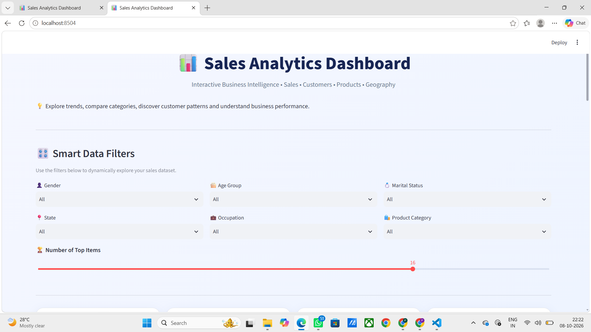 | 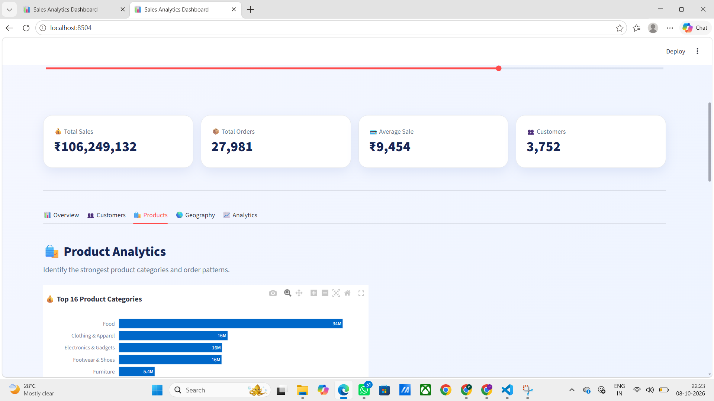 |

| Dashboard Analytics | Sales by Gender |
|---|---|
| 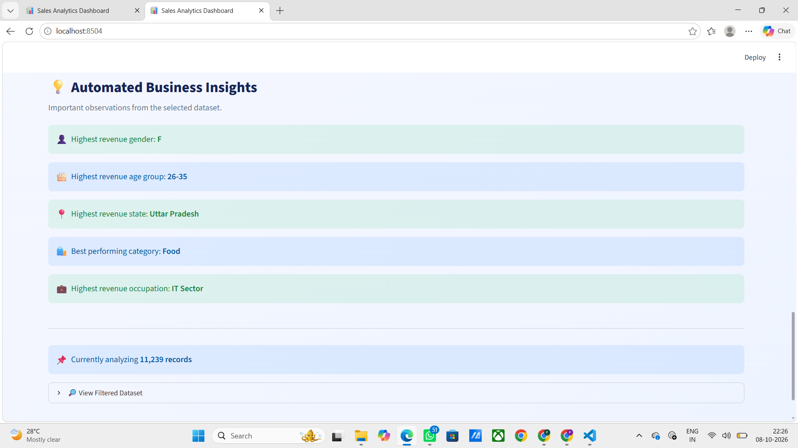 | 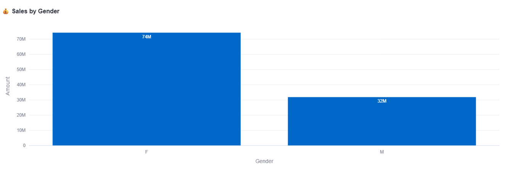 |

---

### 📊 Sales Analysis

| Sales by Age Group | Sales Amount Distribution |
|---|---|
| 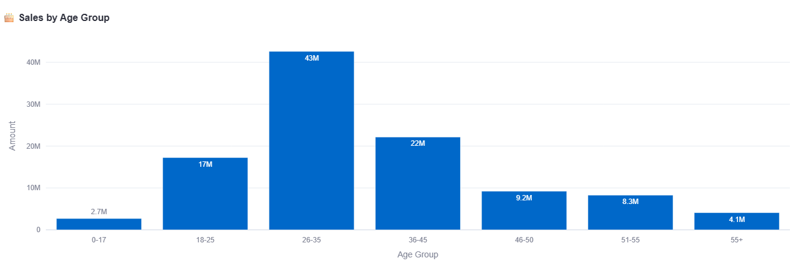 | 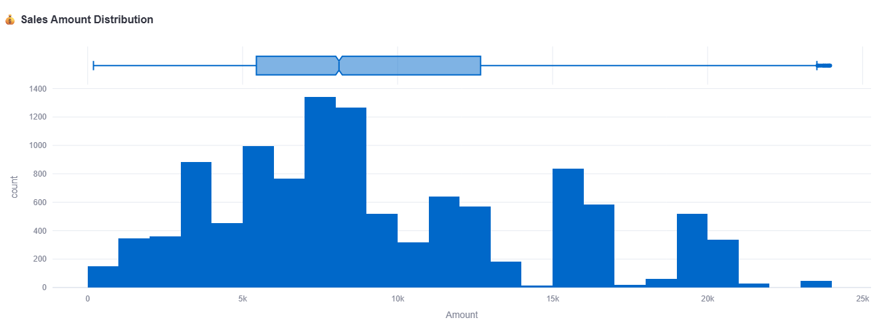 |

| Sales Distribution by Gender | Revenue Contribution |
|---|---|
| 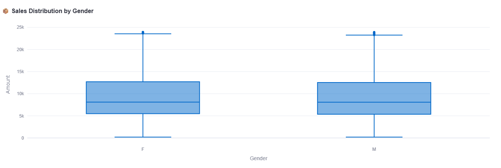 | 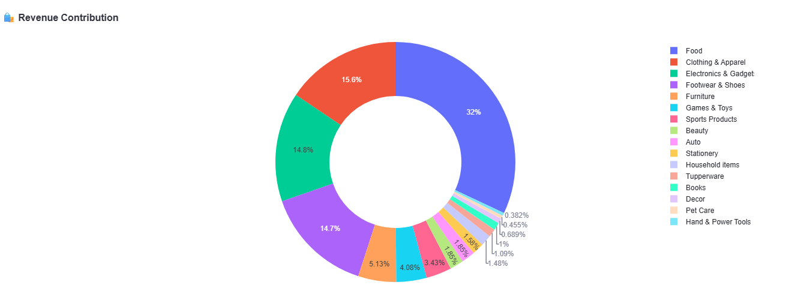 |

---

### 👥 Customer & Product Analysis

| Top Customers | Top Product Categories |
|---|---|
| 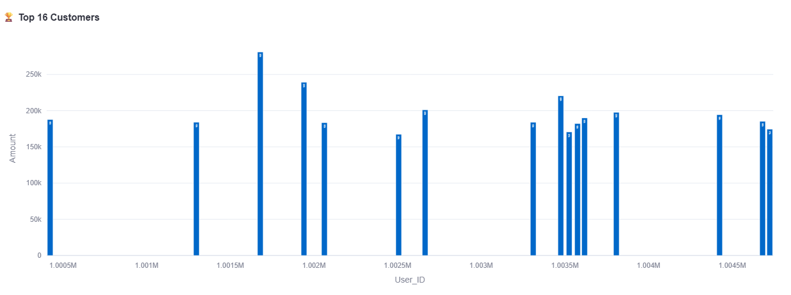 | 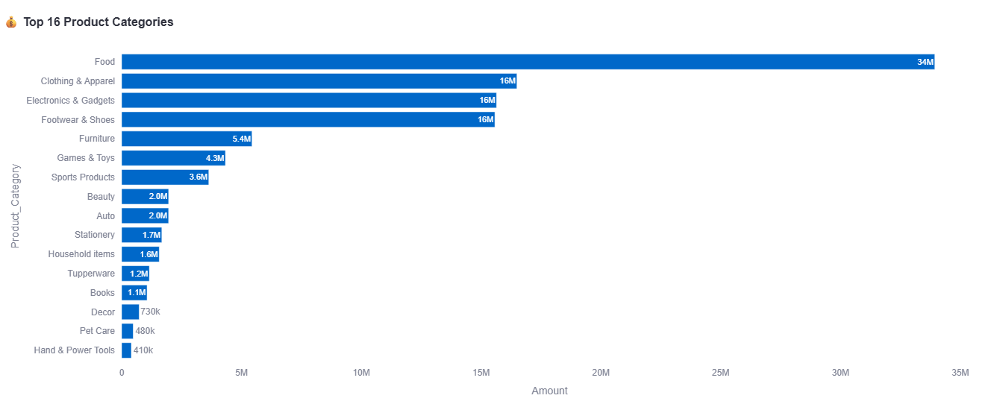 |

| Top Categories by Orders | Correlation Matrix |
|---|---|
| 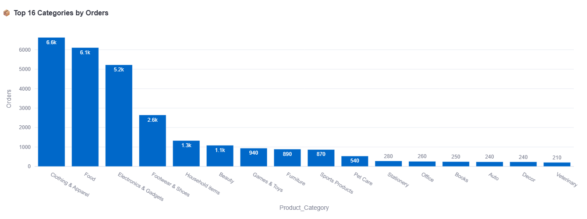 | 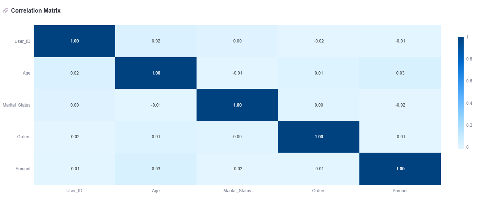 |

---

### 🌎 Geographic Analysis

| Top States by Revenue | Top States by Orders |
|---|---|
| 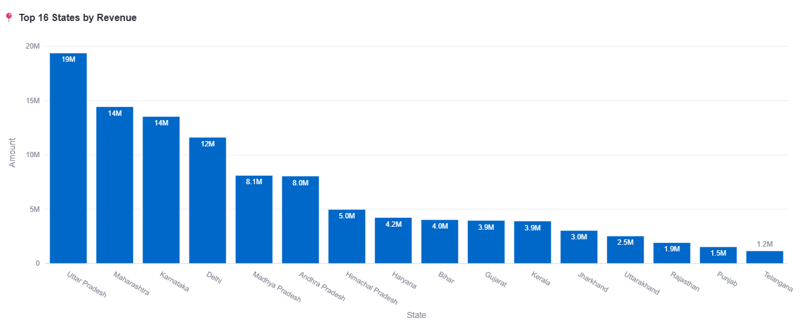 | 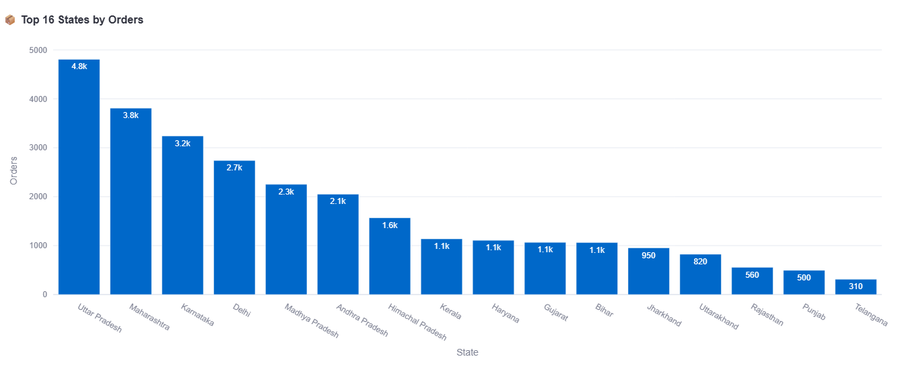
##💡 Key Business Insights
Based on the analysis:
- Female customers generate the highest overall sales.
- The 26–35 age group contributes the highest revenue.
- Uttar Pradesh is the highest-revenue state.
- Food is the best-performing product category.
- IT Sector is the highest-revenue occupation segment.
- Customer-level analysis helps identify high-value customers.
- Product category analysis highlights major revenue contributors.
- Geographic analysis reveals important regional sales patterns. |

##📊 Analytical Modules
The project includes the following analytical modules:
1. Customer Analysis
- Gender-wise sales
- Age-group sales
- Marital-status analysis
- Occupation analysis
- Top customers
2. Product Analysis
- Product category sales
- Product category orders
- Top products
- Revenue contribution
3. Geographic Analysis
- State-wise revenue
- State-wise orders
- Top-performing states
4. Statistical Analysis
- Descriptive statistics
- Sales distribution
- Correlation analysis
- Gender-wise sales distribution
5. Business Intelligence
- KPI monitoring
- Automated business insights
- Interactive filtering
- Dynamic visual analysis
##⚙️ Installation
1. Clone the Repository
git clone https://github.com/priyadharshini2002-source/sales-data-analysis.git

2. Navigate to the Project
cd sales-data-analysis

3. Install Dependencies
pip install -r requirements.txt

##▶️ Run the Dashboard
Run the Streamlit application using:
streamlit run app.py

The dashboard will open in your browser.
##🔬 Run the EDA Script
To execute the complete Python-based exploratory data analysis:
python sales_predict.py

The script performs:
- Data inspection
- Data cleaning
- Statistical analysis
- Customer analysis
- Product analysis
- Geographic analysis
- Correlation analysis
- Visualization
- Automated business insights
##☁️ Deployment
The Streamlit dashboard can be deployed using Streamlit Community Cloud.
After deployment, the live application URL can be added to the Live Demo section.
Example:
https://your-app-name.streamlit.app

##🚀 Future Enhancements
Future improvements may include:
- Sales forecasting using Machine Learning
- Customer segmentation using clustering
- Customer Lifetime Value prediction
- Recommendation systems
- Advanced RFM analysis
- Automated report generation
- Real-time data integration
- Advanced KPI monitoring
- Power BI integration
- Cloud database integration
##⭐ Project Highlights
- 📊 Interactive Business Intelligence Dashboard
- 🐍 Python-based Data Analysis
- 📈 Interactive Plotly Visualizations
- 🎨 Streamlit Dashboard
- 👥 Customer Behavior Analysis
- 📦 Product Performance Analysis
- 🌎 Regional Sales Analysis
- 📌 Automated Business Insights
- 🔎 Exploratory Data Analysis
- 💼 Portfolio-ready Data Science Project
##👩‍💻 Author
S. Priyadharshini
MSc Data Science
Data Science | Business Analytics | Python | SQL | Data Visualization
##📜 License
This project is created for educational, portfolio, and data analysis purposes.


